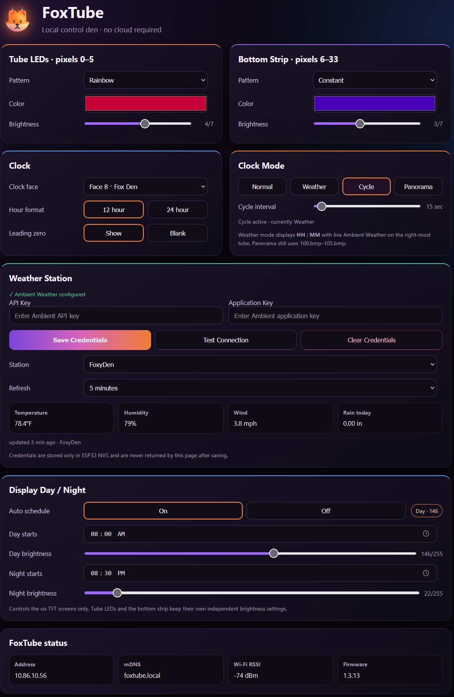
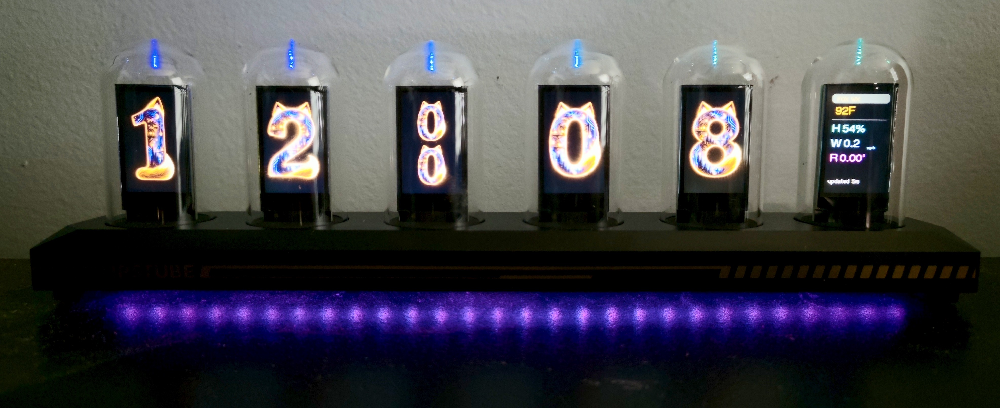

# 🦊 FoxTube

**FoxTube** is an ESP32-S3 port and feature-focused fork of
[EleksTubeHAX](https://github.com/aly-fly/EleksTubeHAX) for newer **IPSTube**
six-display clocks.

It keeps the excellent EleksTubeHAX foundation and adds a FoxTube-specific
ESP32-S3 hardware port, a local responsive Web UI, custom clock artwork,
panorama mode, independent RGB lighting controls, configurable display
brightness scheduling, an Ambient Weather-powered weather clock mode, and
automatic Normal/Weather display cycling.

> **Project status:** FoxTube is a hardware-specific development fork. The
> features documented here are developed and tested on the ESP32-S3 IPSTube
> hardware described below.

---

## FoxTube in action

### Local Web UI

The clock hosts its own responsive control page at `http://foxtube.local/`.
No cloud service is required for normal clock control.

<p align="center">
  
</p>

### Weather Clock

Weather mode changes the six displays to:

```text
[ HH tens ] [ HH ones ] [ : ] [ MM tens ] [ MM ones ] [ WEATHER ]
```

The right-most tube is rendered dynamically with live station data.

<p align="center">
  
</p>

---

## Hardware target

The current FoxTube target uses:

- **ESP32-S3-WROOM-1U**
- **8 MB flash**
- no PSRAM
- six **ST7789 135×240** TFT displays
- six RGB LEDs behind the tubes
- 28-pixel RGB strip under the clock
- one physical button
- hardware PWM display brightness
- NTP timekeeping
- no RTC battery on the tested S3 board

The dedicated PlatformIO environment is:

```text
IPSTube_S3
```

---

## Main FoxTube features

### 🕸️ Local Web UI

FoxTube exposes a responsive local control page at:

```text
http://foxtube.local/
```

The Web UI currently provides control for:

- clock face selection
- 12/24-hour display
- leading zero behavior
- tube RGB pattern, color, and brightness
- bottom-strip RGB pattern, color, and brightness
- Normal / Weather / Cycle / Panorama display modes
- configurable Cycle interval
- day/night TFT brightness scheduling
- Ambient Weather station configuration
- weather refresh interval
- station status and current readings
- device IP, mDNS name, Wi-Fi RSSI, and firmware version

The Web UI is served directly by the ESP32-S3.

---

### 🦊 Fox Den clock face

Clock face 8 is the custom **Fox Den** face.

The digit artwork is stored as:

```text
80.bmp ... 89.bmp
```

The matching Fox Den-style colon used by Weather Clock mode is:

```text
106.bmp
```

---

### 🔄 Cycle mode

Cycle mode automatically alternates between the normal clock display and
Weather Clock mode.

The switching interval is configurable from **5 to 300 seconds**, with a
default of **30 seconds**, and can be changed from either the Web UI or the
one-button menu.

Cycle timing is independent of the Ambient Weather refresh interval. Switching
to the Weather view uses the most recently cached station data and does not
trigger a new API request on every display change.

The selected mode and Cycle interval are stored persistently in ESP32 NVS.

---

### 🖼️ Panorama mode

The six 135×240 displays can be used as one effective **810×240** panoramic
display.

Panorama assets use:

```text
100.bmp ... 105.bmp
```

A long press of the rear button while the clock is idle toggles Panorama mode.

Panorama acts as an overlay, so leaving Panorama returns to the underlying
Normal, Weather, or Cycle mode that was selected previously.

---

### 🌈 Independent RGB lighting

The ESP32-S3 IPSTube RGB chain contains 34 pixels:

```text
pixels 0–5    six tube LEDs
pixels 6–33   28-pixel bottom strip
```

FoxTube gives the tube LEDs and bottom strip independent controls for:

- pattern
- color
- brightness

Supported effects include the existing EleksTubeHAX modes such as Constant,
Rainbow, Pulse, Breath, Test, and Dark.

---

### 🌗 Configurable day/night display brightness

FoxTube adds persistent TFT brightness scheduling.

The following can be configured from either the one-button menu or the Web UI:

- automatic schedule on/off
- day start time
- day display brightness
- night start time
- night display brightness

These settings affect the six TFT screens only. The tube LEDs and bottom RGB
strip keep their own independent brightness settings.

The schedule is stored in ESP32 NVS.

---

## 🌦️ Weather Clock

Weather mode displays:

```text
HH : MM + weather
```

The seconds are replaced by a Fox Den-style colon and the right-most tube
becomes a live weather panel.

The current weather panel shows:

- temperature
- humidity
- wind speed
- daily rain
- update age
- stale-data indication

If an API request fails, FoxTube keeps the last successful reading rather than
blanking the display.

The default refresh interval is **5 minutes** and can be changed from the Web UI.

Cycle mode does not alter this refresh interval. It only changes which cached
display view is currently shown.

### Ambient Weather requirement

> **Weather compatibility:** FoxTube Weather Clock currently supports
> **Ambient Weather stations that are available through the Ambient Weather
> API**. An **Ambient Weather API Key** and **Application Key** are required.
> Other weather-station platforms are not currently supported.

Weather credentials are entered through the FoxTube Web UI.

They are stored locally in a separate ESP32 NVS namespace:

```text
foxweather
```

The saved API keys are not compiled into the firmware and are not returned to
the browser after they have been stored.

After valid credentials are saved, FoxTube discovers the Ambient Weather
stations available to the account and lets you choose the desired station and
refresh interval.

> The FoxTube control page currently uses local HTTP. The initial credential
> submission is therefore not encrypted on the LAN. Keep the FoxTube control
> interface on a trusted local network and do not expose it directly to the
> public Internet.

---

## Wi-Fi configuration

Personal Wi-Fi credentials do **not** need to be committed to the repository.

Create a private secrets header from the included example.

### Windows / PowerShell

```powershell
Copy-Item include\_USER_SECRETS.example.h include\_USER_SECRETS.h
notepad include\_USER_SECRETS.h
```

### Linux / macOS

```bash
cp include/_USER_SECRETS.example.h include/_USER_SECRETS.h
$EDITOR include/_USER_SECRETS.h
```

Then enter your local credentials:

```cpp
#define WIFI_SSID "YOUR_WIFI_SSID"
#define WIFI_PASSWD "YOUR_WIFI_PASSWORD"
```

`include/_USER_SECRETS.h` is ignored by Git.

The tracked `_USER_DEFINES.h` contains only safe placeholder values.

Ambient Weather credentials are configured separately through the FoxTube
Web UI and stored in NVS.

---

## Building FoxTube

FoxTube uses PlatformIO.

From the repository root:

```bash
pio run -e IPSTube_S3
```

A successful build produces the firmware under:

```text
.pio/build/IPSTube_S3/
```

### Building LittleFS

Rebuild the LittleFS image whenever display assets change, including:

- clock faces
- panorama images
- `106.bmp` Weather Clock colon artwork

Run:

```bash
pio run -e IPSTube_S3 -t buildfs
```

---

## Flashing

The current ESP32-S3 partition layout uses:

```text
0x00010000   application
0x00140000   LittleFS
```

### Firmware only

Linux example:

```bash
export PORT=/dev/ttyACM0

esptool --port "$PORT" --baud 460800 write-flash \
  --flash-mode dio \
  --flash-freq 80m \
  --flash-size 8MB \
  0x10000 .pio/build/IPSTube_S3/IPSTube_S3_v1.3.13.bin
```

Windows example:

```powershell
$PORT = "COM5"

esptool --port $PORT --baud 460800 write-flash `
  --flash-mode dio `
  --flash-freq 80m `
  --flash-size 8MB `
  0x10000 .pio/build/IPSTube_S3/IPSTube_S3_v1.3.13.bin
```

Use:

```bash
pio device list
```

to find the connected serial device.

### Firmware + LittleFS

Linux example:

```bash
esptool --port "$PORT" --baud 460800 write-flash \
  --flash-mode dio \
  --flash-freq 80m \
  --flash-size 8MB \
  0x10000 .pio/build/IPSTube_S3/IPSTube_S3_v1.3.13.bin \
  0x140000 .pio/build/IPSTube_S3/littlefs.bin
```

Windows example:

```powershell
esptool --port $PORT --baud 460800 write-flash `
  --flash-mode dio `
  --flash-freq 80m `
  --flash-size 8MB `
  0x10000 .pio/build/IPSTube_S3/IPSTube_S3_v1.3.13.bin `
  0x140000 .pio/build/IPSTube_S3/littlefs.bin
```

Normal updates do **not** require a flash erase. Avoiding an erase preserves the
clock's NVS configuration, including FoxTube settings and Ambient Weather
credentials.

---

## ESP32-S3 display notes

The newer IPSTube board required a dedicated ESP32-S3 hardware port.

One important compatibility fix is included in the vendored TFT_eSPI processor
support for ESP32-S3: the low-level register port must use register index `2`
instead of Arduino-ESP32's `FSPI` enum value.

The S3 environment also uses explicit GPIO mappings for the six TFT chip-select
lines and native USB CDC.

---

## Local configuration storage

FoxTube intentionally keeps its added settings in separate ESP32 Preferences /
NVS namespaces rather than expanding the original EleksTubeHAX stored-config
blob.

Current FoxTube namespaces include:

```text
foxstrip      bottom RGB strip settings
foxdisplay    day/night TFT brightness schedule
foxweather    Ambient Weather, Clock Mode, and Cycle configuration
```

This keeps FoxTube-specific persistence isolated from the upstream configuration
structure.

---

## Current status

The public FoxTube repository uses the `main` branch.

The ESP32-S3 port and the FoxTube features documented above are working on the
tested IPSTube S3 hardware, including:

- all six TFT displays
- Fox Den clock face
- local Web UI
- NTP time
- independent tube LEDs and bottom strip
- panorama mode
- configurable day/night display brightness
- Ambient Weather station discovery
- Weather Clock mode
- automatic Normal/Weather Cycle mode with configurable interval

Contributions and testing on similar ESP32-S3 IPSTube hardware are welcome.

---

## Upstream project

FoxTube is based on **EleksTubeHAX** by `aly-fly` and its contributors.

Upstream project:

- <https://github.com/aly-fly/EleksTubeHAX>

FoxTube keeps the upstream project history and license while adding the
ESP32-S3 port and FoxTube-specific features described in this README.

For documentation covering the broader range of EleksTubeHAX-supported clock
models and upstream features, refer to the upstream project.

---

## License

This project is distributed under the **GNU General Public License v3.0
(GPL-3.0)**, consistent with EleksTubeHAX.

See:

```text
LICENSE
```

for the full license text.

---

## Credits

- **EleksTubeHAX** — `aly-fly` and contributors
- **FoxTube ESP32-S3 port and FoxTube extensions** — `dasoslukos`
- **Ambient Weather** — weather data API used by Weather Clock mode

---

Made with an unreasonable number of foxes. 🦊
